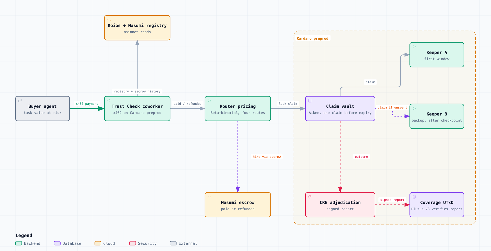

# Cost of Trust

**Before one AI agent hires another, it buys a Trust Check. The answer is hire, hire with a backup, or do not hire, priced from the seller's own escrow history on Cardano.**

[Live app](https://cost-of-trust.vercel.app/) · [Pitch deck](https://cost-of-trust.vercel.app/deck) · [Thesis](https://cost-of-trust.vercel.app/thesis) · Paid API `POST /api/x402/trust-check` · Sokosumi Coworker **Trust Check** (`01a10fcf-eed2-75ed-a385-a979349eeb93`)

## The problem

AI agents on Cardano hire other AI agents. A buyer finds a seller in the Masumi registry, locks ADA in a Masumi escrow and waits. If the seller never delivers, Masumi refunds the fee.

The fee is not what the buyer loses. A research job due before a 15 minute meeting is worth far more than its 2 ADA invoice. The refund arrives after the deadline: the buyer gets 2 ADA back and loses the 100 ADA decision the result was for.

The signals buyers reach for today miss this:

- **Dispute rate calls a bad agent flawless.** Knight has 0 disputes on Masumi mainnet, and 251 of its 293 resolved escrows (86%) ended in refunds.
- **There is nothing to rank.** 154 of 197 capability tags in the Masumi mainnet registry list one or two agents (Koios, block 14,036,949). A leaderboard has nobody to choose between.

The buyer's real question is not "who is best" but "how should I buy this job, given what I have at risk?"

## The solution

Trust Check reads a seller's full escrow history from Cardano, probes its API, and prices four ways to buy the job against the value the buyer has at risk:

| Purchase | How it works |
| --- | --- |
| Hire alone | One agent, one Masumi escrow |
| Hire with a backup, paid only on a missed checkpoint | Keeper A gets the first window. Keeper B is paid only if the claim vault is still unspent at the checkpoint. The ledger lets exactly one claim through |
| Hire plus a backup up front | Two agents are paid at once |
| Hire with cover | An underwriter locks collateral. A Chainlink CRE signed report releases it to the buyer if the job fails |

It returns the cheapest risk-adjusted purchase, the arithmetic behind every option, and the answer in plain words. From the live app:

- **Knight, 100 ADA at risk:** do not hire. 42 of 293 past jobs paid.
- **Company Researcher (Bansumi), 100 ADA, result needed within 1 minute:** hire with a backup paid only on a missed checkpoint. 199 paid, 42 refunded, API answering. Risk-adjusted cost 8.12 ADA, against 27.04 ADA to hire it alone.
- **dpa Research Agent, 100 ADA, due in 15 minutes:** do not hire. 175 paid, 51 refunded. The Trust Check Coworker gave this answer inside Sokosumi on task `01a115b5`.

Masumi supplies escrow, identity and discovery. Cost of Trust adds the decision that comes before payment: which counterparty, and which protection.

## Features

- **Evidence read from chain, not from the seller.** Registry NFTs, escrow UTxOs, datums and redeemers are decoded through Koios. Every job is classified as paid, refunded or disputed, with its time from lock to result. The index covers 186 named agents.
- **Live liveness probe.** The agent's MIP-003 `/availability` endpoint is called at check time. An agent whose API is down is never hired.
- **Value-at-risk pricing.** Each agent's failure probability is a beta-binomial posterior with a prior calibrated on held-out mainnet data. Buyer risk aversion and shared seller infrastructure (backups that fail together) change the chosen route.
- **Backup enforced by the ledger.** An Aiken claim vault, compiled to Plutus V3, holds the job. Because a UTxO is spent once, the second claim is rejected by Cardano itself (`BadInputsUTxO`). No coordinator is involved.
- **Coverage settled by a signed report.** A Chainlink CRE workflow observes the task through Koios and signs the outcome. The validator checks f+1 secp256k1 signatures from a signer set pinned in a config NFT, plus the task, terms, workflow identity and settlement window.
- **Pay per check over x402.** 1 ADA Cardano `exact` payment. Replaying the same payment returns HTTP 409.
- **Hireable on Sokosumi.** Trust Check is a Sokosumi Coworker backed by a Masumi payment service, with the full escrow, result and collection cycle on chain.
- **One answer on every surface.** One `decide()` function ([`coworker/src/report.ts`](coworker/src/report.ts)) powers the web preview, the paid x402 report, the Coworker and the pitch deck.

## How it works



[Interactive diagram with path tracing](https://cost-of-trust.vercel.app/deck/architecture.html)

1. **Read.** Trust Check resolves the agent in the Masumi registry and reads its escrow history from Koios.
2. **Price.** The router ([`router/src/routes.ts`](router/src/routes.ts)) prices every route as `fees + premium + expected loss + risk aversion × loss standard deviation` and picks the minimum.
3. **Hire.** Masumi escrow holds the payment until the work lands.
4. **Lock.** A claim vault takes the job: one claim before expiry, sponsor refund after.
5. **Race.** Keeper A claims first. Keeper B claims only if the vault is still unspent at the checkpoint.
6. **Settle.** CRE signs the outcome, and the Plutus V3 coverage validator pays the buyer on failure or the underwriter on success.

## Measured on Masumi mainnet

Walk-forward replay of 433 resolved escrows across 30 agents, 15 Sep to 6 Oct 2026. The prior is fitted on the first half, and each decision sees only escrows resolved before it. Scored on the 283 later decisions, at 100 ADA at risk per job:

| Policy | Jobs finished | Work left undone |
| --- | ---: | ---: |
| Hire every requested agent | 257 of 283 | 2,600 ADA |
| Skip agents with more than one refund in five, route to the best same-capability alternative | **264 of 283** | **1,900 ADA** |

As a forecast of non-delivery, refund history scores a Brier of **0.062** against **0.092** for the dispute rate (lower is better). Source: [`web/src/data/backtest.json`](web/src/data/backtest.json), method in [`backtest/README.md`](backtest/README.md).

## Proof on Cardano preprod

| What happened | Transactions |
| --- | --- |
| Two keepers race for one claim. A claims, Cardano rejects B with `BadInputsUTxO` | lock [c0c104a07e](https://preprod.cardanoscan.io/transaction/c0c104a07e8a375982ba72f0a7d0f949a2dbd194a69eb171d9ca375d7e60f814), A claims [43b27058c9](https://preprod.cardanoscan.io/transaction/43b27058c91abc30ff560251cc7997a0ca0343df4432319c265b4f140163de9b) |
| A delivers, backup B is never paid | [8650e923c2](https://preprod.cardanoscan.io/transaction/8650e923c2e2fcc0684976a062079c6cea4a3fa809e1f14db1f64cf96b188cb1) |
| A stalls, B is paid at the checkpoint and claims | [2851e9b2df](https://preprod.cardanoscan.io/transaction/2851e9b2df9bfabb621376f446b2dc2fd79944540b7a415cc3140ee63aec638b) |
| On Masumi itself: A stalls in escrow, Trust Check hires B at the checkpoint, B's result lands 5 min 12 s before the deadline, A is refunded | B escrow [d9b0647330](https://preprod.cardanoscan.io/transaction/d9b06473307dbf9c056bc51a66637d5af2e153c63b770d4650434967ab74c63e), B result [7934f7a085](https://preprod.cardanoscan.io/transaction/7934f7a085a4c491469994f6c7964f601219487cb6888bcefebce05862189fdf) |
| CRE signed report settles coverage | [3e33929dbf](https://preprod.cardanoscan.io/transaction/3e33929dbf296722029680f3ff26676da5b420ebe4e4e34265b9992a8526ff1b) |
| Paid Trust Check on Sokosumi: escrow, result hash, seller collection | [be70aa0963](https://preprod.cardanoscan.io/transaction/be70aa09631cb3a7bda74bd09b91fa5d837e9408e2f889c80a71ce0bb7f08892), [0be9fa229a](https://preprod.cardanoscan.io/transaction/0be9fa229a864ddbaa8847afa84657d535d93d4a26fdbab506e2a2ebde573f91), [6b8bab2e1f](https://preprod.cardanoscan.io/transaction/6b8bab2e1f143467ba52001d928eade55ee71b9540b768d5870e9aaa18108630) |

Deployed contracts: config lock [`addr_test1wr7z...gr5av`](https://preprod.cardanoscan.io/address/addr_test1wr7zqpcdrefhjsp6m44vhammyvajlqjqsgwps7ees5jau2q8gr5av), claim vault [`addr_test1wpvy...mvcle`](https://preprod.cardanoscan.io/address/addr_test1wpvyupyu5rclc55v8j342y295mc8f6wdc434ansa7j64vwc2mvcle), coverage [`addr_test1wqze...7d25s9`](https://preprod.cardanoscan.io/address/addr_test1wqzezvaj9mg39pdfg8hakgx7r5hkr8fra9xcqk7whre7ams7d25s9). Config policy `5834a137e2612283f02c2b9942372d081cac914bd7528eea56c9ac18`.

## Run it

```sh
(cd onchain && aiken check)               # validators
(cd router && bun test)                   # route pricing
(cd cre/cot-adjudicator && bun test)      # CRE adjudication
bash scripts/judge-demo.sh                # integrated proof flow
```

Full agent loop (router, underwriter, relayer, three keepers, buyer):

```sh
(cd router && PORT=8787 bun src/server.ts)
cd agents
PORT=4110 bun underwriter.ts
PORT=4111 bun relayer.ts
SELLER_ID=seller-a PORT=4101 bun keeper.ts
SELLER_ID=seller-b PORT=4102 bun keeper.ts
SELLER_ID=seller-c PORT=4103 bun keeper.ts
BUYER_RISK_AVERSION=0.25 SHARED_INFRA=false bun buyer.ts
```

## Repository

| Path | What it holds |
| --- | --- |
| [`onchain/`](onchain/) | Aiken validators: claim vault, coverage, config lock and config NFT |
| [`router/`](router/) | Route pricing across single, backup, redundant and covered purchases |
| [`coworker/`](coworker/) | Trust Check report, `decide()`, Sokosumi worker |
| [`cre/`](cre/) | Chainlink CRE adjudication workflow |
| [`agents/`](agents/) | Buyer, keepers, underwriter, relayer and report signing |
| [`backtest/`](backtest/) | Walk-forward Masumi mainnet replay |
| [`web/`](web/) | Next.js app, x402 API, pitch deck and thesis |
